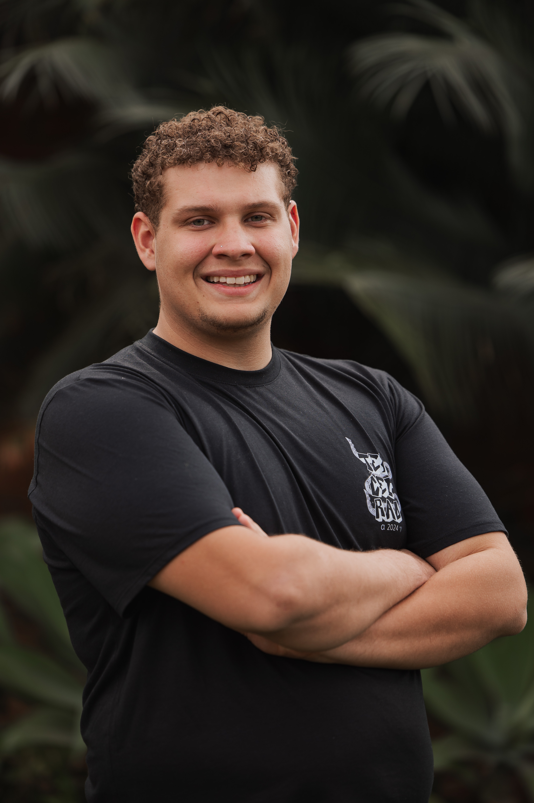

<h1 align="center">Opa, eu sou o Cauã Thomarco</h1>

  
  
  

🎓 Estudante de **Engenharia de Software** na **PUC Minas** – 1º período  
💡 Interessado em desenvolvimento web, lógica de programação, sistemas numéricos e engenharia de software  
🚀 Criando projetos do zero, aprendendo com a prática e com paixão por resolver problemas

---

### 📊 Estatísticas Gerais

- 🔢 **Repositórios públicos**: 2  
- 📈 **Contribuições nos últimos 12 meses**: 21  
- 📂 **Projetos principais**:
  - [FireShield](https://github.com/ICEI-PUC-Minas-PMGES-TI/pmg-es-2025-1-ti1-2401100-fireshield.git) – site de denúncia de queimadas usando HTML, CSS, JS e JSON Server
  - [CRUD Mercadorias](https://github.com/cleverson-programmer/SistemaLogistica-SLEM) - O sistema de Logística de Entrega de Mercadorias (SLEM)
  - [Hotel Descanso Garantido](https://github.com/CauaThomarco/Hotel-Descanso-Garantido.git)  - Sistema de gerenciamento de um Hotel em C++
---

### 🛠️ Tecnologias que domino ou tenho experiência

#### 💻 Desenvolvimento Web

#### 🧠 Lógica de Programação e Algoritmos

#### ⚙️ Ferramentas e Softwares

---

### 📈 GitHub Stats

  

---

### 📬 Contato

Se quiser entrar em contato comigo ou colaborar em algo, me chama em alguma de minhas redes sociais!  
- [LinkedIn](https://www.linkedin.com/in/thomarco)

---

⭐ Obrigado por visitar meu perfil!  
🛠️ Em constante evolução — **siga para acompanhar meu progresso**!
