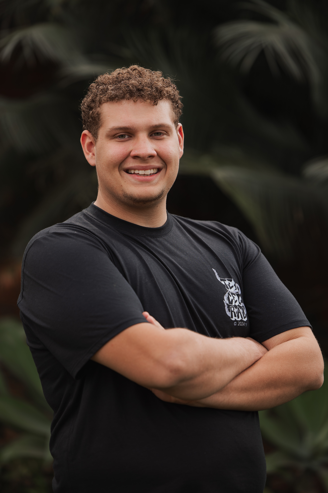

# Opa, eu sou o Cauã Thomarco 👋

 

---

🎓 Estudante de **Engenharia de Software** na **PUC Minas** — 4º período  
💼 Fundador da **[Síntese Digital](https://sintesedigitaldev.com.br/)** — soluções web customizadas em BH  
🚀 Desenvolvedor Full Stack apaixonado por resolver problemas reais com tecnologia

---

### 🏢 Síntese Digital

Fundei a **Síntese Digital** para criar aplicações web 100% customizadas — sem templates genéricos.  
Desenvolvimento de e-commerce, sistemas para hotelaria, gestão interna, websites institucionais e backends robustos com APIs.

📍 Belo Horizonte, MG &nbsp;|&nbsp; 💻 100% remoto &nbsp;|&nbsp; 🟢 Aberta para novos projetos

---

### 📊 GitHub Stats

  
  

  

---

### 📂 Projetos Principais

| Projeto | Descrição | Tecnologias |
|---|---|---|
| [🔥 FireShield](https://github.com/ICEI-PUC-Minas-PMGES-TI/pmg-es-2025-1-ti1-2401100-fireshield.git) | Plataforma de denúncia de queimadas | HTML, CSS, JS, JSON Server |
| [📦 SLEM](https://github.com/cleverson-programmer/SistemaLogistica-SLEM) | Sistema de logística de entrega de mercadorias | C++ |
| [🏨 Hotel Descanso Garantido](https://github.com/CauaThomarco/Hotel-Descanso-Garantido.git) | Sistema de gerenciamento de hotel | C++ |
| [🏠 StayHub](https://github.com/Programacao-Modular-PUC/trabalho-pratico-stayhub.git) | Sistema de aluguel de imóveis | HTML, CSS, JS, Java, Spring Boot, PostgreSQL |
| [🌸 Jardim Magnólia](https://github.com/ICEI-PUC-Minas-PMGES-TI/pmg-es-2026-1-ti2-3740100-magnolia.git) | E-commerce de floricultura | React, Java, Spring Boot, PostgreSQL |
| [🌅 Ponta da Represa](https://pontadarepresa.com.br/) | Site de hospedagem — chalés (cliente real) | React 19, TypeScript, Tailwind v4, Vite, Java, Spring Boot |

---

### 🛠️ Tecnologias & Ferramentas

#### 🌐 Frontend

#### ⚙️ Backend

#### 🗄️ Banco de Dados

#### 🚀 DevOps & Ferramentas

---

### 📬 Contato

Se quiser entrar em contato, colaborar ou contratar a Síntese Digital, me chama!

---

  ⭐ Obrigado por visitar meu perfil! Em constante evolução — <strong>siga para acompanhar meu progresso</strong>!

